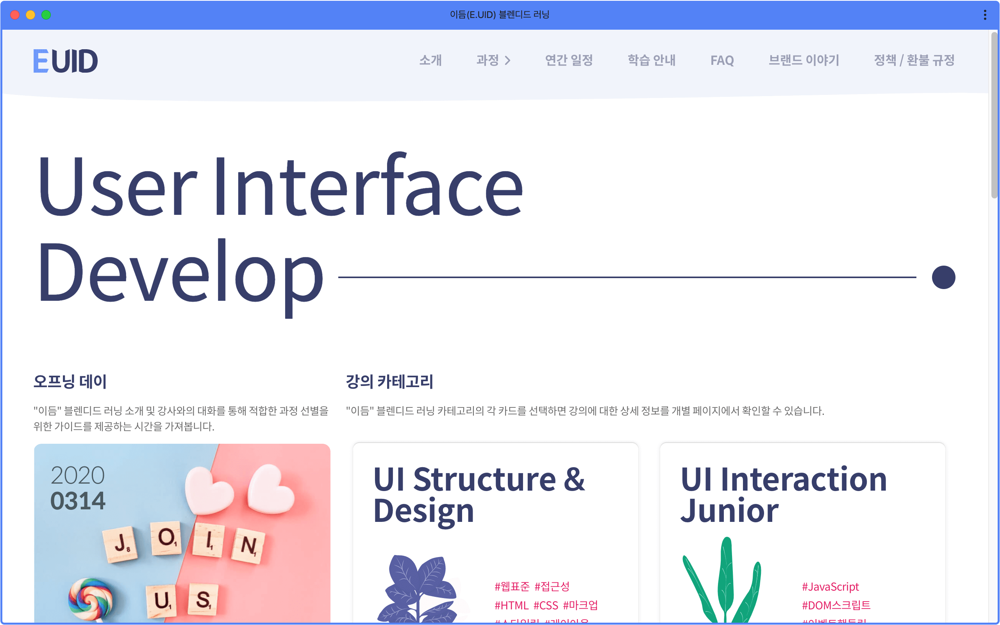
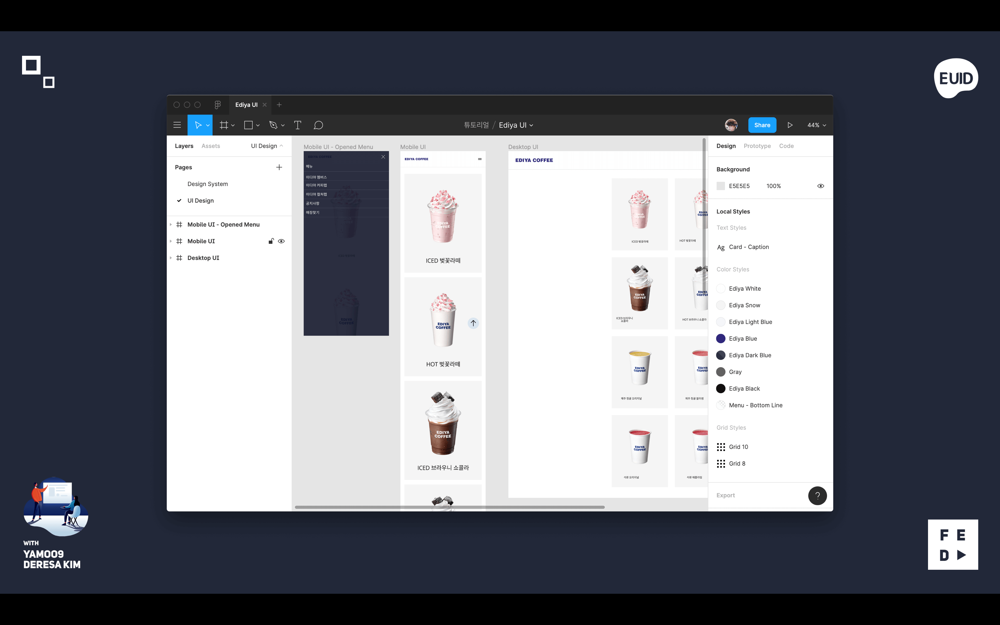
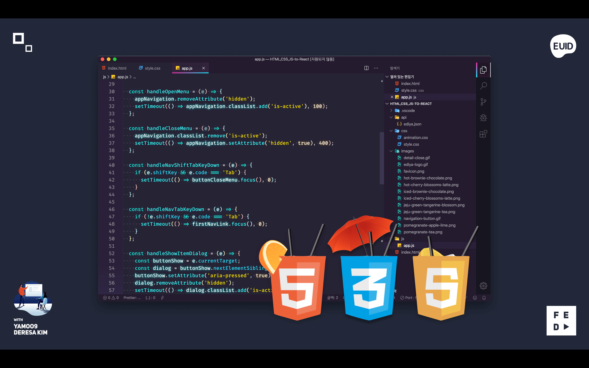
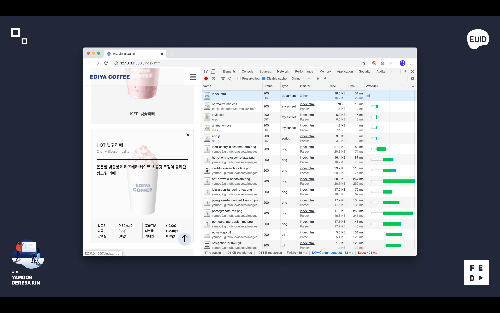
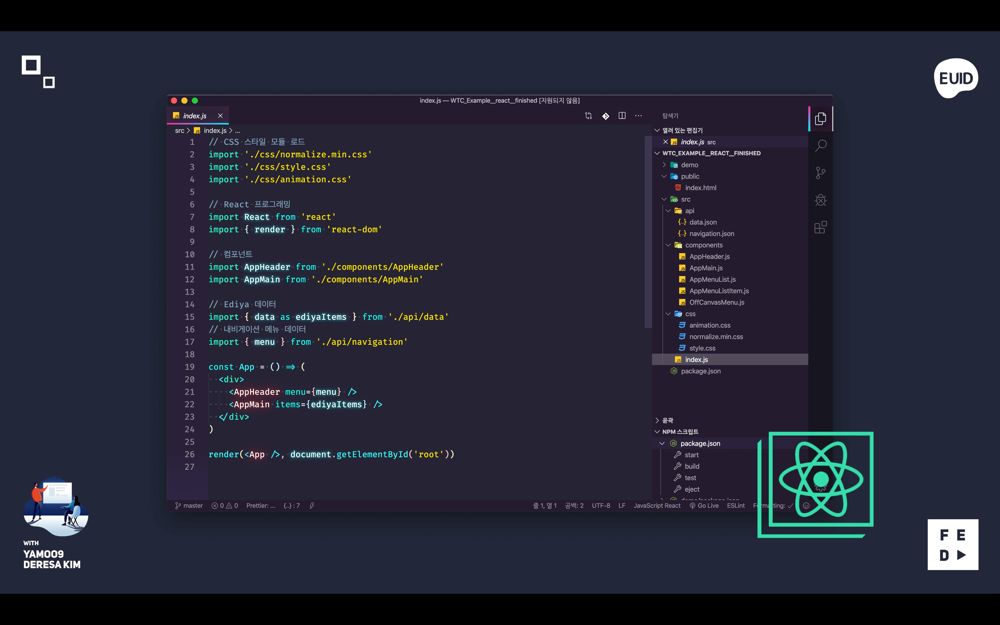

# Ediya UI 디자인 & 개발 러닝 가이드

"이디야(Ediya)" 디자인 리소스를 활용하여 [이듬(E.UID) 블렌디드 러닝](https://yamoo9.github.io/EUID) UI 디자인/개발을 학습합니다.

<figure style="margin: 0">
  
  <figcaption style="text-align: center"><a target="_blank" href="http://yamoo9.github.io/EUID">yamoo9.github.io/EUID</a></figcaption>
</figure>

## 1. UI 디자인

Figma 디자인 도구를 사용하여 멀티 스크린 UI 디자인을 제작합니다.

## 2. UI 웹 개발

HTML, CSS, JavaScript(ES6)를 사용하여 웹 UI 구조 설계, 스타일, 레이아웃, 애니메이션, 인터랙션을 구현합니다. 
🎬시연 영상 → <a href="https://www.youtube.com/watch?v=Qat54yulTHM">Ediya UI 웹 개발</a>

네트워크 리소스 요청, 응답 속도를 확인하여 성능 최적화를 고려합니다.

## 3. React 앱 개발

웹 표준 개발 기술로 제작 된 결과를 React 프레임워크를 활용하여 컴포넌트 시스템으로 재구축 합니다.

